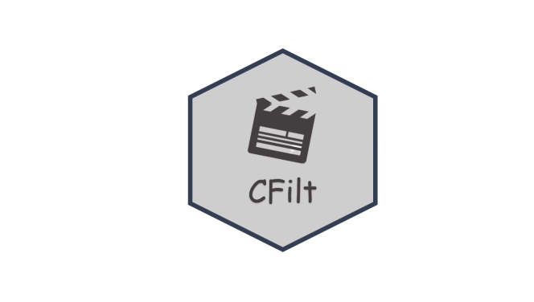

 

 A recomendação de itens para consumidores na rede de internet se mostra como uma das ferramentas mais importantes no que tange a utilização de plataformas de venda e entretenimento. Como exemplos, podem ser citados: a recomendação de produtos em sites de vendas, como a Amazon; a recomendação de filmes e músicas em serviços streaming, como a Netflix, Spotify e Youtube; e recomendações de contatos sociais no Facebook, Instagram e Twitter.

  Esse pacote foi desenvolvido no software estatístico R usando programação orientada a objeto, tornando mais amigável a criação de objetos, as manipulações dos bancos de dados e os processos de recomendação utilizando o método de Filtragem Colaborativa. O Pacote está atualmente disponível no CRAN.

Versão 2

[Acessar o Tutorial de Uso do Pacote](https://thiagoslima21.github.io/CFilt/Tutorial-Pacote-CFILT.html)

